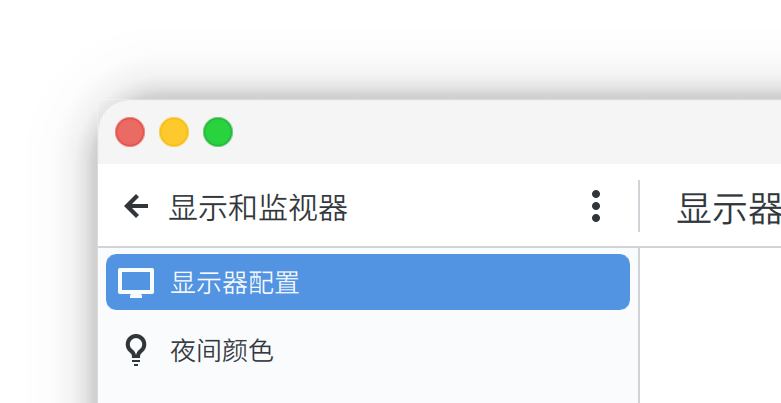

# Kde-Lights

Kde-Lights 是用于 KDE Aurorae 引擎的窗口装饰主题系列，它模拟各种灯光风格（如 Mac 的红黄蓝信号灯）。

## 截图

这是本系列主题对 Mac 装饰的模拟（MacLights）：

_本主题并不复刻任何模仿对象的图标。_

## 说明

Kde-Lights 的设计语言是：

- 深而宽的阴影
- 夸张的大圆角
- 圆形的具有彩色背景的按钮

本系列主题并不追求对模拟对象（如 macOS）的 1:1 还原，而是对其风格的重新诠释。本项目所有图标皆为作者设计，无任何挪用/复制。

## 已知问题

- 分数缩放环境，偶数宽度/高度的窗口可能会在单侧多出 1px 的边缘。这可能是 KDE 的 bug，主题无法修复。
- 圆角处可能看到模糊的直角虚边（通过放大镜），这似乎是过往 KDE 的 bug 回归。本主题无能无力。
